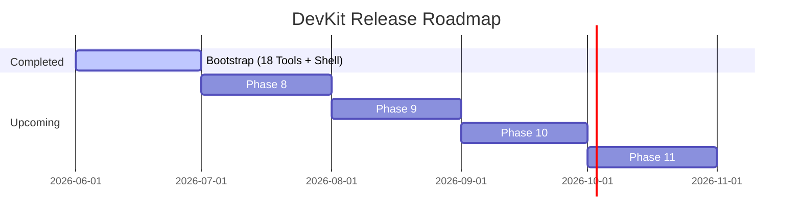

# DevKit Project Roadmap

This document outlines the development history, current project milestones, and upcoming feature phases for DevKit.

---

## 1. Completed Milestones (Bootstrap Era)

The bootstrap release successfully implemented 18 tools across 7 core phases:

### Phase 1: Foundation & Scaffolding

- Initialized Tauri v2 and React 18 configuration.
- Configured Vite build parameters, Tailwind CSS, and shadcn/ui.
- Setup quality linters (ESLint, Prettier, TypeScript).

### Phase 2: Core Shell & Navigation

- Created the main vertical sidebar ([MenuPanel.tsx](file:///Users/kezlo/Workspaces/kezlo/dev_utility_tools/src/components/menu-panel.tsx)) with alphabetical sorting and favorites filtering.
- Implemented the command palette (`Cmd/Ctrl+K`) with fuzzy search matching, keyword mapping, and a history of the last 8 navigated tools.
- Wrote the [app-store.ts](file:///Users/kezlo/Workspaces/kezlo/dev_utility_tools/src/store/app-store.ts) store with namespaced persistence syncing state before components mount to avoid layout flashes.
- Wrapped tool workspaces inside a shared [ToolPageShell.tsx](file:///Users/kezlo/Workspaces/kezlo/dev_utility_tools/src/components/tool-page-shell.tsx) equipped with an error boundary.

### Phase 3: Tool Wave A — Format & Encode

- Implemented **JSON**, **YAML**, **XML**, and **SQL** formatters with parsing validation.
- Created **Base64** and **URL** encoders/decoders.

### Phase 4: Tool Wave B — Generators & Text

- Built **UUID (v4/v7)** and **ULID** generators.
- Built a **QR Code** generator.
- Added a **Timestamp** converter (Unix to ISO-8601 and vice-versa).
- Created a **Password generator** utilizing browser Web Crypto CSPRNG.
- Added a **Case converter**, **Text diff** viewer, and **Regex tester** (with safety caps).

### Phase 5: Tool Wave C — Rust-backed Crypto

- Built the **Hash tool** supporting MD5 (spark-md5) and SHA-1/256/384/512 (Web Crypto).
- Wired Tauri commands for **bcrypt** hashing and verification, offloading operations to background threads.
- Added symmetric **JWT** decoding and verification (HS256/HS384/HS512).

### Phase 6: Cron Tools

- Developed the **Cron Expression Explorer** (schedules preview using `cron-parser` and `cronstrue`).
- Developed the **Crontab Validator** checking multi-line cron configurations.

### Phase 7: Polish & CI

- Created smoke tests to render each tool inside the registry.
- Scaffolding workflows for static lint checks and GitHub Action release builds.
- Added UX polish: copy confirmation toasts, loading spinners, and layout constraints.

---

## 2. Current State

- **Completed Tools:** 18 utilities are fully built, tested, and operational.
- **Shell Features:** Global spotlight quick-access launcher (OS hotkey → floating search bar → small tool window), tray icon, and hide-on-close background lifecycle are shipped — see [roadmap-near-term.md](./roadmap-near-term.md) under "Done".
- **CI Pipelines:** Automated static checks (`typecheck-lint`) run on every PR. Build pipelines package installer binaries on tag pushes.
- **Signing Status:** Unsigned. Installers compile cleanly but trigger Gatekeeper (macOS) and SmartScreen (Windows) warnings.

> Near-term feature queue (next tools after the spotlight launcher) lives in [roadmap-near-term.md](./roadmap-near-term.md). This document tracks the longer-horizon release phases below.

---

## 3. Future Roadmap & Releases

### Phase 8: Code Signing & Release Automation (Target: v0.2.0)

- Provision Apple Developer Program certificates and Windows Authenticode signing certificates.
- Populate GitHub repository secrets to automatically sign `.dmg`, `.msi`, and `-setup.exe` bundles during CI.
- Staple macOS notary tickets to clear Gatekeeper prompts for end-users.

### Phase 9: Secure Auto-Updates (Target: v0.3.0)

- Enable Tauri's native auto-update client.
- Set up updater keys (`TAURI_SIGNING_PRIVATE_KEY` / `TAURI_SIGNING_PRIVATE_KEY_PASSWORD`).
- Deploy a static JSON update feed on GitHub Pages or Cloudflare Workers.

### Phase 10: Asymmetric Cryptography (Target: v0.4.0)

- Expand JWT tool to support asymmetric key verification (RS256/384/512, ES256/384/512).
- Add a RSA/ECDSA keypair generator utility.
- Add certificates parser (PEM to JSON metadata).

### Phase 11: Local File Tools (Target: v0.5.0)

- Build an offline **Image Optimizer** (PNG, JPEG, WebP resizing and compression).
- Build a **CSV to JSON / JSON to CSV** data converter.
- Add a **dotenv Formatter** (re-indexing local environment config files).

## Related Documents

- [project-overview-pdr.md](file:///Users/kezlo/Workspaces/kezlo/dev_utility_tools/docs/project-overview-pdr.md) - Features scope details
- [codebase-summary.md](file:///Users/kezlo/Workspaces/kezlo/dev_utility_tools/docs/codebase-summary.md) - Source code details
- [deployment-guide.md](file:///Users/kezlo/Workspaces/kezlo/dev_utility_tools/docs/deployment-guide.md) - Release building instructions
