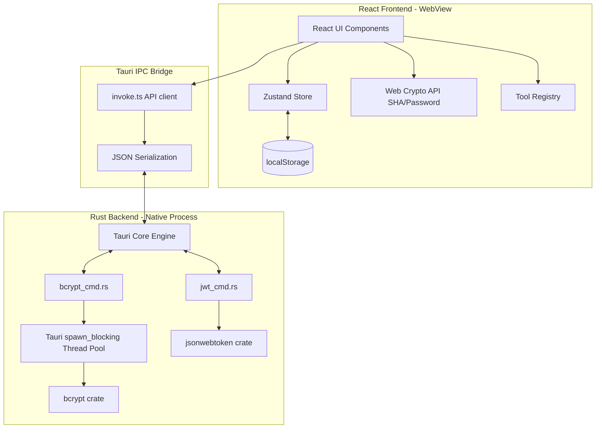
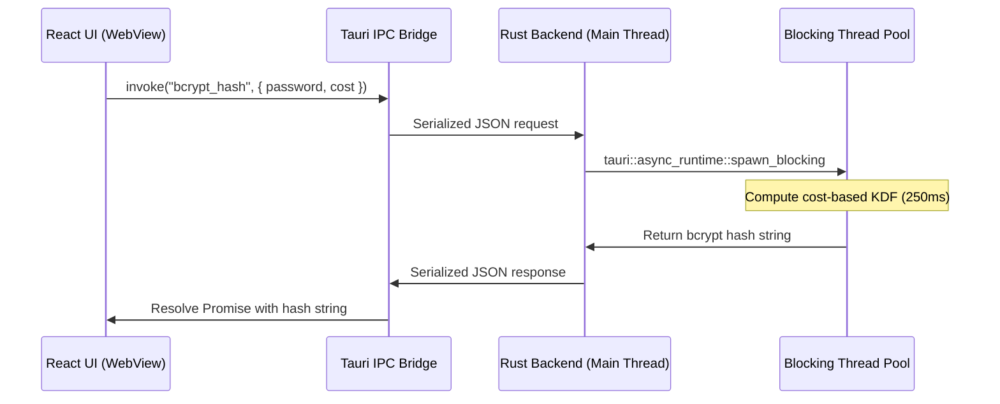

# System Architecture & Security Model

DevKit is designed as a secure, sandboxed desktop application that runs completely offline. It utilizes a dual-process architecture separating the visual presentation layer (WebView) from the system operations layer (Rust Core).

## 1. System Overview & Component Diagram

The application consists of a **React WebView** (running inside macOS WebKit or Windows WebView2) and a **Native Rust process** managed by Tauri v2.

---

## 2. Frontend-Backend Boundary

Operations are split across the boundary based on CPU cost and security requirements:

| Operation                     | Environment        | Execution Type               | Rationale                                                       |
| ----------------------------- | ------------------ | ---------------------------- | --------------------------------------------------------------- |
| Formatting & Diffing          | Frontend (WebView) | Synchronous / JS Thread      | Direct string manipulations; low CPU cost.                      |
| SHA Hashing & Password Gen    | Frontend (WebView) | Asynchronous / Web Crypto    | Uses browser's native CSPRNG and digests. Avoids IPC overhead.  |
| QR Code Generation            | Frontend (WebView) | Asynchronous / Canvas        | Rendered directly to local canvas element.                      |
| Bcrypt Hashing & Verification | Backend (Rust)     | Asynchronous / Native Thread | Extremely high CPU cost; offloaded to a background thread pool. |
| JWT Verification              | Backend (Rust)     | Asynchronous / Native Thread | Native validation and cryptographic signature checking.         |

---

## 3. Tauri IPC Architecture

Communication across the frontend-backend boundary uses Tauri's JSON-RPC-like message protocol:

- **Serialization:** Inputs are serialized to JSON in JavaScript and deserialized into Rust data structures (using `serde`) on the backend.
- **Asynchronous Execution:** All commands registered in [lib.rs](file:///Users/kezlo/Workspaces/kezlo/dev_utility_tools/src-tauri/src/lib.rs) are asynchronous.
- **Bcrypt Background Threading:** When a CPU-intensive command like `bcrypt_hash` is invoked, it runs inside a dedicated blocking thread pool using `spawn_blocking` to avoid blocking the main OS event loop.

### Command Execution Sequence

---

## 4. Security Model

Security is paramount as developers process sensitive files, tokens, and payloads.

### 4.1 Sandboxing & Capabilities

- **Tauri Allowlist:** The application uses Tauri's capability system. In [default.json](file:///Users/kezlo/Workspaces/kezlo/dev_utility_tools/src-tauri/capabilities/default.json), only `core:default` is allowed.
- **No File System Access:** The WebView has no access to the host file system. There are no capabilities enabled for read/write files (e.g., `fs:read` or `fs:write` are omitted).
- **No Network Permissions:** The app lacks HTTP capabilities. It cannot make external calls, preventing data exfiltration.

### 4.2 State Isolation

- **Scoped Local Storage:** Persistence is isolated to the application ID `com.kezlo.devkit`.
- **In-Memory Payloads:** All input developer payloads (like SQL scripts or decoded JWT claims) are held in React state volatile memory and are cleared when the tool is switched or the app is closed.

## Related Documents

- [codebase-summary.md](file:///Users/kezlo/Workspaces/kezlo/dev_utility_tools/docs/codebase-summary.md) - Code layout and registry details
- [code-standards.md](file:///Users/kezlo/Workspaces/kezlo/dev_utility_tools/docs/code-standards.md) - Coding style conventions
- [design-guidelines.md](file:///Users/kezlo/Workspaces/kezlo/dev_utility_tools/docs/design-guidelines.md) - Visual layout guidelines
