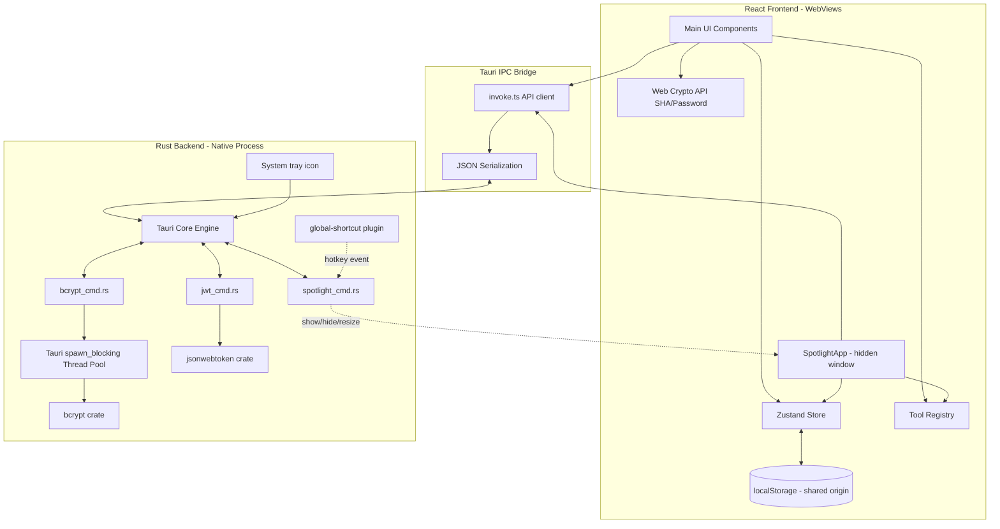
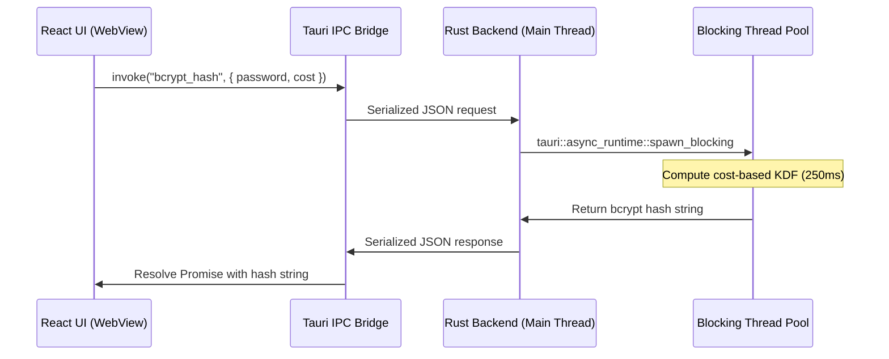

# System Architecture & Security Model

DevKit is designed as a secure, sandboxed desktop application that runs completely offline. It utilizes a dual-process architecture separating the visual presentation layer (WebView) from the system operations layer (Rust Core). The Rust process hosts **two webview windows** — the main DevKit window and a hidden `spotlight` quick-access window — plus a system-tray icon and a global hotkey, so the app keeps running in the background after the main window is closed.

## 1. System Overview & Component Diagram

The application consists of a **React WebView** (running inside macOS WebKit or Windows WebView2) and a **Native Rust process** managed by Tauri v2.

---

## 2. Frontend-Backend Boundary

Operations are split across the boundary based on CPU cost and security requirements:

| Operation                     | Environment        | Execution Type               | Rationale                                                       |
| ----------------------------- | ------------------ | ---------------------------- | --------------------------------------------------------------- |
| Formatting & Diffing          | Frontend (WebView) | Synchronous / JS Thread      | Direct string manipulations; low CPU cost.                      |
| SHA Hashing & Password Gen    | Frontend (WebView) | Asynchronous / Web Crypto    | Uses browser's native CSPRNG and digests. Avoids IPC overhead.  |
| QR Code Generation            | Frontend (WebView) | Asynchronous / Canvas        | Rendered directly to local canvas element.                      |
| Bcrypt Hashing & Verification | Backend (Rust)     | Asynchronous / Native Thread | Extremely high CPU cost; offloaded to a background thread pool. |
| JWT Verification              | Backend (Rust)     | Asynchronous / Native Thread | Native validation and cryptographic signature checking.         |

---

## 3. Tauri IPC Architecture

Communication across the frontend-backend boundary uses Tauri's JSON-RPC-like message protocol:

- **Serialization:** Inputs are serialized to JSON in JavaScript and deserialized into Rust data structures (using `serde`) on the backend.
- **Asynchronous Execution:** All commands registered in [lib.rs](file:///Users/kezlo/Workspaces/kezlo/dev_utility_tools/src-tauri/src/lib.rs) are asynchronous.
- **Bcrypt Background Threading:** When a CPU-intensive command like `bcrypt_hash` is invoked, it runs inside a dedicated blocking thread pool using `spawn_blocking` to avoid blocking the main OS event loop.

### Command Execution Sequence

---

## 4. Security Model

Security is paramount as developers process sensitive files, tokens, and payloads.

### 4.1 Sandboxing & Capabilities

- **Per-Window Capability Files:** The application uses Tauri's capability system, scoped per window:
  - [default.json](file:///Users/kezlo/Workspaces/kezlo/dev_utility_tools/src-tauri/capabilities/default.json) — scoped to the `main` window. Allows `core:default`, plus `opener:default` and `dialog:allow-open` / `dialog:allow-save` for the Base64 file tool's native file pickers.
  - [spotlight.json](file:///Users/kezlo/Workspaces/kezlo/dev_utility_tools/src-tauri/capabilities/spotlight.json) — scoped to the `spotlight` window. Allows `core:default` only. All window show/hide/resize and hotkey rebind operations are performed through custom Rust commands in [spotlight_cmd.rs](file:///Users/kezlo/Workspaces/kezlo/dev_utility_tools/src-tauri/src/commands/spotlight_cmd.rs), so the spotlight WebView needs no direct window-management or global-shortcut plugin permissions — it only `invoke`s those commands and `listen`s for events (both covered by `core:default`).
- **No File System Access:** Neither WebView has general file-system access. The Base64 file tool reads/writes files exclusively through Rust commands reached via the native dialog picker, not through WebView `fs:` permissions.
- **No Network Permissions:** The app lacks HTTP capabilities. It cannot make external calls, preventing data exfiltration.

### 4.2 Multi-Window & Background Lifecycle

- **Second Window:** A `spotlight` window is created hidden at startup (undecorated, always-on-top, skip-taskbar, transparent, resizable). It is shown/hidden/resized only via Rust commands in response to the global hotkey, and mounts `SpotlightApp` (instead of the main `App`) when the webview URL carries the `?window=spotlight` query param.
- **Global Hotkey:** Registered via `tauri-plugin-global-shortcut`. The default is per-platform — `Option+Space` on macOS, `Ctrl+Alt+Space` on Windows/Linux (plain `Alt+Space` is reserved by Windows). A failed rebind re-registers the previous combo so a working shortcut is never silently dropped; the error surfaces inline in the in-app hotkey settings.
- **Background Running & Tray:** Closing the main window is intercepted (`prevent_close` + `hide`) so the process — and the global hotkey — keep running. A system-tray icon provides "Show DevKit" (restore the main window), "Show Spotlight" (open the quick-access window), and "Quit DevKit" (the only real exit path).
- **OS Permissions (macOS):** First global-shortcut use may trigger a one-time macOS Accessibility / Input Monitoring prompt; this is an OS permission gate, not an app bug.

### 4.3 State Isolation

- **Scoped Local Storage:** Persistence is isolated to the application ID `com.kezlo.devkit`. Both webviews share the same storage origin, so favorites, theme, and recents set in the main window are visible to a tool opened via spotlight.
- **In-Memory Payloads:** All input developer payloads (like SQL scripts or decoded JWT claims) are held in React state volatile memory and are cleared when the tool is switched or the app is closed.

## Related Documents

- [codebase-summary.md](file:///Users/kezlo/Workspaces/kezlo/dev_utility_tools/docs/codebase-summary.md) - Code layout and registry details
- [code-standards.md](file:///Users/kezlo/Workspaces/kezlo/dev_utility_tools/docs/code-standards.md) - Coding style conventions
- [design-guidelines.md](file:///Users/kezlo/Workspaces/kezlo/dev_utility_tools/docs/design-guidelines.md) - Visual layout guidelines
